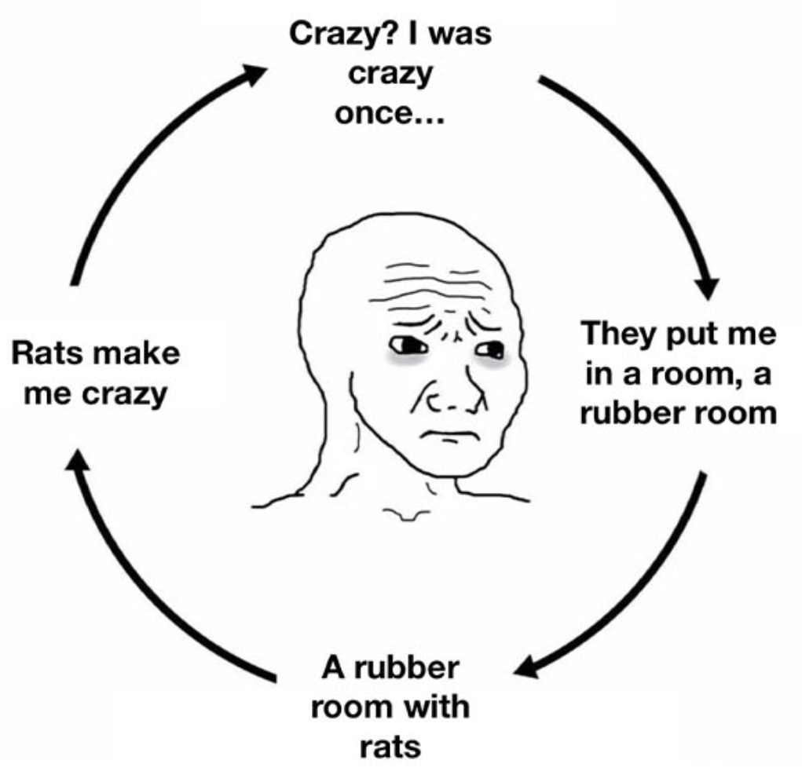

---
title: "Perspective of the Process of Creative Writing in an AI Era"
description: ""
pubDate: 2026-10-01
tags: ["#English Project", "#Writing", "#Teaching", "#Reflection"]
cover: ../../assets/process-writing.webp
coverAlt: "A girl floating while holding balloons"
---

In a world where **AI** *(unless you have been living under a rock, I'll assume that you are familiar with the concept of **Artificial Intelligence**)* or **SI** *([Super Intelligence as Trump proclaims](https://www.foxnews.com/live-news/ai-leaders-trump-meeting-google-executive-order))* is taking over, the line that divides the job of a teacher from manageable to challenging is becoming blurry. Not because AI is taking our jobs, as many people say, but mostly because students are somehow taking advantage of AI in a way that teachers who are not catching up with this technology are being outperformed; ironically, not by peers. This writing has no intention of shaming students, as technology is meant to be used, but the main argument of this writing is to analyze how education is mutating from the perspective of a teacher and from the observations of an educational project carried out at my workplace where students were the focus.

## Background

To understand this [pseudo-analysis](https://www.dictai.org/w/pseudoanalytical), it's important to highlight the background, what was measured and how, edge cases, and what output was obtained to come up with such conclusions. First of all, the main source of information was taken from a project carried out over three weeks, during which ESL intermediate students were asked to write an essay. For most of them, it was their first time dealing with such a concept, as not even in their [L1](https://www.teachingenglish.org.uk/professional-development/teachers/teaching-knowledge-database/d-h/l1) was this something they were familiar with. Moreover, some difficulties were evident at first glance. As students are learning a new language, it was quite an issue to take them from zero to writing an essay in English; hence, some were doubtful and skeptical about it. However, it all began anyway; theory was taught, and thus practice followed. Every day, for an hour or so, step by step, students were building an essay from scratch. Since a classroom is a controlled environment, the topics were assigned by the teacher beforehand to avoid any unforeseen events. And thus, the basis of writing an essay was established.

Generally speaking, the writing process refers to the steps involved in producing an organized, well-structured text; thus, it's a time-consuming activity. Therefore, having witnessed their writing day by day was the main motivation for this writing. Notes and feedback were given, but I also set aside the data collected to tell the story. Observing their weaknesses, strengths, and constraints made me realize the scale of the task they were given. I'm not a big fan of emotions during the learning process, but some kind of pity flourished. So, midway through the first week, I decided to start over and take them step by step, idea by idea, through the process of writing an essay. I asked them to first brainstorm what they had in mind when they thought about the chosen topic, to write not correct sentences but small ideas they could relate to, etc. Basically, I broke the task down into the smallest digestible pieces they could afford. Nonetheless, it was not enough. Problems significantly decreased, but some minor issues still remained to tackle.

## It's So Over: Is Teaching Actually Doomed?

It was not painless, for sure... But it was not impossible—or so I wanted to believe... After a couple of days, AI entered the chat—*sigh*. And so it all began to fall apart. The outcome became polluted by AI slop. Anyone can tell when something is AI-generated, especially teachers. Students producing essays that were *far beyond what they had demonstrated in class* was like addressing the elephant in the room. Vocabulary, organization, grammatical structures, and transitions just did not match their previous work.

To illustrate:

#### Student writing:

> Social media is good because we can communicate with people.

#### AI writing:

> In an increasingly interconnected digital landscape, social media has emerged as a transformative force that fundamentally reshapes interpersonal communication.

Same student. Same week. Apparently, someone got a PhD overnight.

Either (A) all the work I had been doing with them finally paid off, or (B) they discovered the magical cheating machine... Spoiler: B is correct. Frankly speaking, I truly wished that A was the correct option. No matter what, all the drafts they turned in for me to check sounded nothing like the students. And that was how I started to wonder, *Is teaching actually doomed?*

Furthermore, the problem was not students using AI per se, not at all, but it worked as a turning point that made me step back and ask myself: "What exactly am I evaluating?" Indeed, there was a mismatch. All this time, I had been asking the wrong questions. So the problem shifted from students using their magical cheating machine—which was part of the issue but did not cover the big picture—to questioning whether the old writing-assessment model could keep up with the actual standards. Relying on an outdated assessment tool became quite difficult to trust.

## Outcome: False Positive Or I'm Just Being Delusional

Hey! Don't get me wrong. I don't want this post to fit into the "it's so over, we're so back" narrative or become an anti-AI rant. I'm genuinely trying to be as impartial as possible. Remember that I said that I might be asking the wrong questions? I made up my mind and asked: *"But how do I actually know?"*

The possibility that I might be making a mistake was low, but not zero. But here's why I pondered this possibility:

1. **A student may genuinely improve.**
2. **A student may have received legitimate help.**
3. **Some students naturally write better than they speak.**
4. **A teacher's intuition is useful, but it isn't proof.**

The more I suspected AI, the more uncomfortable I became with the possibility that I might be wrong. So the question shifted from *Did AI write this?* to *Can the student demonstrate ownership of what they wrote?* And surprisingly enough, most of them could demonstrate that they understood what they had written. They were actually looking for words to express their ideas, which ultimately led me to realize that I had been wrong—not completely, but enough to reconsider my assumptions. In other words, they did learn! And that's mostly the point.

## We're So Back: Lesson Learned

First of all, this project has been a challenge, not only for them but also for me. A handful of mixed emotions, moving on from frustration to realization, felt like having an [epiphany](https://en.wikipedia.org/wiki/Epiphany_(feeling)). So... Is teaching actually doomed? No, but maybe some practices are.

I would argue that AI is not eliminating teachers. But I firmly believe that it's exposing teaching methods that had already become obsolete. Teachers are basically evaluating the final *product* rather than the *process*. The problem was not necessarily AI. The problem was that the final essay no longer contained enough information about how the student got there.

Ultimately, this whole "writing an essay" thing started as an attempt to teach them how to write an essay. Ironically, it ended up teaching me something about **teaching essays in the AI age.**
